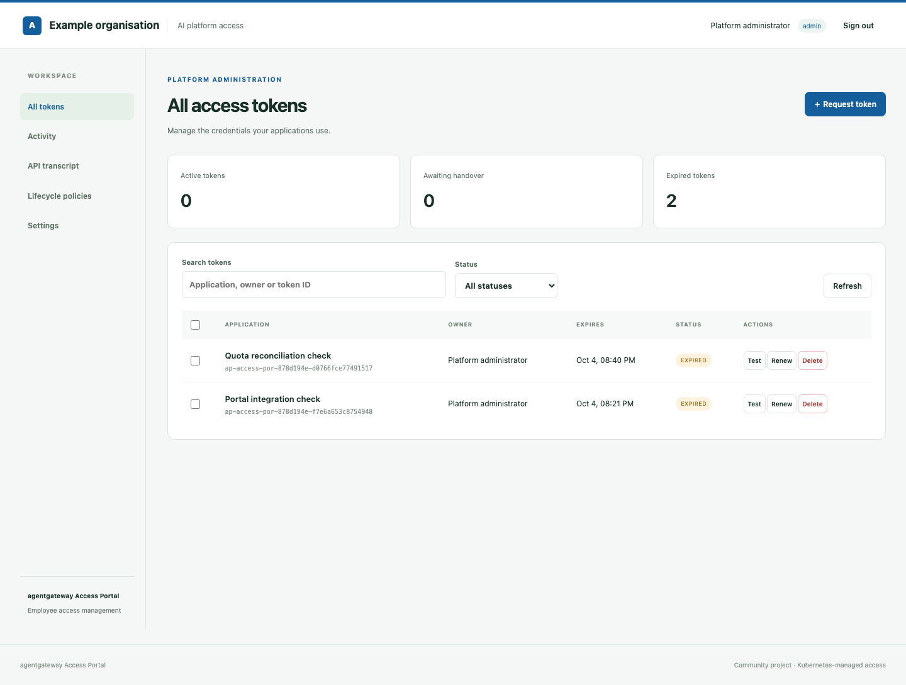

# agentgateway Access Portal

An employee portal for managing the access tokens used by applications calling agentgateway. Administrators connect an existing Gateway, configure corporate sign-in and set lifecycle defaults. Employees see their own tokens; administrators can manage all tokens in the installation.

This is a community-maintained application. Its `AccessToken` resource is defined by this project, not a built-in Kubernetes object or a Solo-supported key-management API.



## What is included

- An organisation-neutral web interface, with a first-install wizard and day-two settings.
- OpenID Connect sign-in using authorisation code, PKCE, verified ID tokens and group-based roles.
- Token creation, model permissions, expiry, rotation handover, renewal, revocation and bulk deletion.
- Gateway discovery within an explicit set of Kubernetes namespaces.
- Corporate profile JSON import and validated PNG/JPEG/WebP logo uploads.
- Per-employee switches for API transcript and lifecycle-policy visibility, enforced by the server.
- Encrypted token-value storage, so values and handovers survive portal restarts.
- A Helm chart and Kyverno CEL policies for reconciliation and scheduled lifecycle changes.

There are no bundled employee accounts or persona-login shortcuts. Test identities exist only in the explicitly invoked test fixtures.

## Requirements

- Kubernetes 1.29 or later and Helm 3.14 or later. Helm 4 is also tested.
- An existing agentgateway installation and a Gateway you control. The chart does not install agentgateway or an LLM provider.
- An OIDC provider which returns the configured group claim in its ID tokens.
- Kyverno 1.19-compatible CEL APIs when using the included policies. The optional dependency pins chart **3.9.0**, which runs **Kyverno v1.19.0**.
- Enterprise agentgateway for the default budget policies. Set `enterpriseBudgets.enabled=false` on an OSS-only cluster.

The full lifecycle has been tested with Enterprise agentgateway 2026.8.2 and Kyverno 1.19.0. The budget-free chart mode is separately render-tested.

## Install

The default uses an **existing Kyverno** installation and deploys the portal policies:

```bash
git clone https://github.com/tjorourke/agentgateway-access-portal.git
cd agentgateway-access-portal
helm repo add kyverno https://kyverno.github.io/kyverno
helm dependency build charts/agentgateway-access-portal

helm upgrade --install access-portal charts/agentgateway-access-portal \
  --namespace access-portal --create-namespace \
  --set publicURL=https://access.example.com \
  --set 'gateway.namespaces[0]=agentgateway-system' \
  --wait --timeout 10m
```

Configure an Ingress or your own route to the ClusterIP Service. Set `publicURL` to the exact externally visible origin. HTTPS is required except for loopback development URLs.

For a local installation, retain `publicURL=http://localhost:8080` and use the port-forward command printed by Helm. Find the generated names and bootstrap Secret in:

```bash
helm get notes access-portal -n access-portal
```

### Kyverno options

| Configuration | Result |
|---|---|
| Default: `kyverno.enabled=false`, `policies.enabled=true` | Use the installed engine; install this portal's policies. |
| `kyverno.enabled=true` | Install pinned Kyverno and the portal policies together. |
| `policies.enabled=false` | Install no Kyverno policies or clock. Supply an external reconciler implementing the [resource contract](docs/architecture.md). |

```bash
# Install the pinned engine too, in a separate kyverno namespace.
helm upgrade --install access-portal charts/agentgateway-access-portal \
  -n access-portal --create-namespace --set kyverno.enabled=true \
  --wait --timeout 10m
```

Bundled Kyverno is owned by this Helm release. Use an independently managed engine for a shared production policy platform. With an existing installation, configure `kyvernoIntegration.namespace` and its controller service-account names if they differ from the defaults.

Helm's post-install/upgrade job applies the policies after their APIs are available, checks readiness, and proves a real expiry transition with a temporary zero-hash record. The probe has no issued credential and is removed afterwards. A compiler-ready policy alone is not considered sufficient.

**Existing-engine discovery:** when introducing a new CRD to a running Kyverno 1.19 installation, its cached resource discovery can require refreshing. Enable `admissionController.crdWatcher=true` in that engine's Helm values; if the installation probe reports a discovery problem, refresh its admission and background controllers and retry the portal upgrade. The bundled engine enables CRD watching and starts after the portal CRD is installed. The portal does not grant itself permission to restart a customer's policy engine.

## First setup

1. Retrieve the bootstrap credential using the command printed by `helm get notes`.
2. Open `/admin` and enter it.
3. Import an organisation profile or enter company name, title, description, accent colour and logo. An example is in [`examples/corporate-profile.json`](examples/corporate-profile.json).
4. Choose a discovered Gateway. Discovery is restricted to `gateway.namespaces`, which also defines the installed RBAC scope.
5. Configure OIDC issuer, client ID, group claim and group mappings.
6. Configure models, default expiry, rotation age, budget and employee visibility, then save.

Saving disables bootstrap access and ends the setup session. Continue through corporate sign-in.

The portal refuses to attach its managed API-key policy to a Gateway which already has an unrelated API-key policy. Use a dedicated Gateway, or set `gateway.managePolicy=false` and configure its authentication yourself. In external-policy mode, select ConfigMaps with both:

```yaml
accessportal.io/instance: <the instance name printed in Kubernetes labels>
accessportal.io/token-store: "true"
```

The optional test base URL must expose OpenAI-compatible `/v1/chat/completions`. Rotation completion rechecks the replacement there; configure it before using verified handovers. The preferred test model is used only when the token permits it, otherwise the token's first permitted model is tested.

## Who is an administrator?

The portal verifies the provider's signature, issuer, audience, expiry, nonce and login state. It then evaluates the **verified group claim**:

```yaml
config:
  auth:
    issuer: https://identity.example.com/realms/employees
    clientId: access-portal
    groupsClaim: groups
    adminGroups: [ai-platform-admins]
    userGroups: [ai-platform-users]
    allowAllAuthenticated: false
```

- Membership in an administrator group grants administrator access.
- Otherwise, membership in an employee group grants access to the employee's own tokens.
- Other identities are denied unless `allowAllAuthenticated` explicitly allows them as users.
- A browser-supplied role, username or owner field does not grant access.

Use the exact group values emitted by your provider, including any group-path prefix or directory group IDs. Entra app roles can be used by setting the group-claim name to `roles`. Configure the provider to include these claims in **ID tokens**.

Register `<publicURL>/auth/callback` as the redirect URI. Public clients use PKCE without a client secret. For a confidential client, create a Secret and reference it through Helm:

```yaml
auth:
  clientSecret:
    existingSecret: portal-oidc
    key: client-secret
```

The client secret is never put into the settings ConfigMap. Relevant verified identity claims are encrypted in an HttpOnly, SameSite session cookie. Sessions expire no later than the ID token or `auth.sessionSeconds`. Provider membership changes take effect at the next sign-in/session expiry; changing the portal's group mappings is evaluated on subsequent requests.

## Day-two management

Administrators use **Settings** for branding, gateway discovery, model choices, lifecycle defaults and employee visibility. The same interface used during installation remains available afterwards.

```yaml
config:
  features:
    userTranscript: false
    userPolicies: false
```

These switches hide the employee navigation and suppress transcript data or deny policy API access. Administrators retain visibility. Policy YAML is read-only in the portal; manage policy definitions through Helm or GitOps.

Default expiry applies to newly created or renewed tokens. Updating the rotation interval changes active-token rotation deadlines. Budget changes are reconciled into existing per-generation budgets. Model-list changes determine choices for new/edited tokens; edit or revoke existing tokens to remove their permissions.

Changing the selected Gateway requires no active tokens. Historical records retain their original gateway binding; request new tokens for a new Gateway. You can correct the test endpoint or preferred test model without moving the Gateway.

### Configuration and storage

| Data | Storage |
|---|---|
| Organisation profile, OIDC public configuration, group mappings, feature flags, gateway choice and lifecycle defaults | Installation settings ConfigMap |
| Token state, permissions, deadlines, generation history and hashes | `AccessToken` custom resources |
| Gateway-accepted hashes | Generated ConfigMaps in the gateway namespace |
| Token values | Fernet-encrypted payloads in per-token Kubernetes Secrets |
| Encryption key, session key and bootstrap credential | Installation Secret or `secrets.existingSecret` |
| OIDC client secret | Referenced Secret supplied by the operator |

Back up the encryption-key Secret with the encrypted token-value Secrets. Replacing the encryption key without re-encrypting stored values makes those values unreadable. Revocation and deletion do not depend on decrypting them.

### Kubernetes permissions

The Helm installer defines the permissions; the wizard checks them but cannot expand them.

- The portal service account manages token records, values and Events in its installation namespace.
- Gateway discovery, hash-store reads and managed gateway policies are limited to `gateway.namespaces`.
- GatewayClass discovery and reads of this installation's named Kyverno policies are cluster-scoped, read-only permissions.
- The policy installer has a separate service account in the **Kyverno control-plane namespace**, not the employee portal namespace.
- Kyverno receives token-reconciliation and gateway-resource permissions through the chart's controller bindings.

Employee access control is enforced by the portal using OIDC identity and record ownership. Kubernetes sees the portal's service account, not an impersonated employee. Portal Events include a stable actor ID; configure Kubernetes API-server auditing, export and retention for durable platform evidence. Events alone are not an immutable audit archive.

Set `rbac.create=false` and supply an appropriately authorised service account if your platform team manages portal RBAC separately. The policy-installation/controller permissions are still required when `policies.enabled=true`.

## Lifecycle behaviour

Manual rotation publishes a replacement and checks the gateway while retaining the original. After applications migrate, **Complete rotation** rechecks the replacement before retiring overlapping generations. Failed verification retains existing access.

Scheduled rotation publishes a pre-generated replacement hash. Its encrypted value is already stored by the portal. It never claims that clients have migrated or silently retires the original. Expiry withdraws all live generations, including overlap. **Renew** gives an expired token a fresh value; expired values remain invalid.

The one-minute cluster clock and Kyverno do not depend on the portal process. Scheduling, reconciliation and gateway propagation introduce delay; this is not exact-deadline request-path expiry. Monitor the clock Jobs and policy-controller health.

Enterprise budgets are scoped to exact credential-generation IDs, rather than a wildcard across unrelated installations. Each generation has a separate daily allowance. Request-rate policies are a separate gateway feature and are not configured by the token-budget field.

## Upgrades, recovery and uninstall

Settings and clock ConfigMaps are created once using Helm hooks, then owned by their runtime writers. They are retained across upgrades. `settings.resetOnUpgrade=true` deliberately reapplies the supplied `config` values. Session/encryption/bootstrap keys are preserved using the installed Secret, unless an external Secret is supplied.

If incorrect identity settings prevent administrator sign-in, an authorised Kubernetes operator can edit the settings ConfigMap and set `configured` back to `false`, then use the installation's bootstrap credential to repeat setup. This is an operator recovery path, not an employee endpoint.

Normal uninstall with managed policies revokes records, removes accepted hash stores and encrypted token values, and removes this installation's policies. Gateway authentication remains strict, so it does not turn a previously protected Gateway anonymous. History records, the CRD and runtime settings remain for explicit operator retention decisions. External-reconciler installations must implement their own withdrawal/cleanup process.

Do not skip uninstall hooks if you depend on that withdrawal. Remove retained resources explicitly when disposing of the installation.

## Development and checks

```bash
python3 -m venv .venv
source .venv/bin/activate
pip install -e '.[test]'
helm repo add kyverno https://kyverno.github.io/kyverno
helm dependency build charts/agentgateway-access-portal
pytest -q
helm lint charts/agentgateway-access-portal
```

For local development, `LOCAL_KUBECTL_PROXY=http://127.0.0.1:8001` can target an explicitly started `kubectl proxy`. Kubernetes deployments use the projected service-account token and cluster CA; no cluster-admin kubeconfig is bundled.

The live fixtures in `tests/` are opt-in and use an isolated test OIDC provider with real RSA signatures and PKCE, plus a mock model. They are not chart defaults. [`tests/live_checks.py`](tests/live_checks.py) covers real sign-in, role/ownership enforcement, feature flags, manual and scheduled rotation, expiry, renewal, budgets and bulk deletion against a deployed portal.

## Source and support

Source and issues: [github.com/tjorourke/agentgateway-access-portal](https://github.com/tjorourke/agentgateway-access-portal).

See [architecture and the external reconciler contract](docs/architecture.md) for the resource boundaries and policy behaviour.
